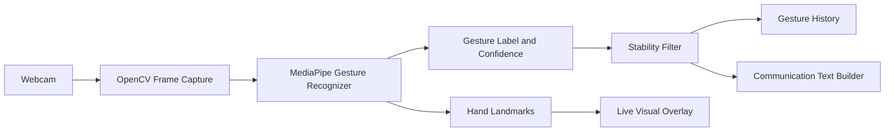

# GestureSpeak: Real-Time Hand Gesture Recognition

GestureSpeak is a polished desktop application that uses a laptop webcam and a pretrained MediaPipe model to recognize hand gestures in real time.

## Screenshot

Run the app and press `s` to save a screenshot to `outputs/screenshots/`.

## Features

- Live OpenCV webcam feed with a 21-point hand skeleton overlay
- Gesture label, confidence percentage, handedness, FPS, and color-coded status
- Temporal stability filtering before gesture history or message updates
- Ten-item timestamped history and a gesture-to-communication text builder
- Keyboard controls for safely quitting, clearing, hiding history, screenshots, and resets
- Automatic one-time download of the official pretrained model

## ML model

This project deploys MediaPipe's open-source pretrained Gesture Recognizer model; no custom model is trained or fine-tuned. MediaPipe detects a hand, estimates its 21 hand landmarks, and classifies the supported gesture categories. GestureSpeak is a hand gesture and basic communication gesture recognizer, not a full sign-language translator.

## Supported gestures

| Model output | App display name | Communication phrase |
|---|---|---|
| `Open_Palm` | Open Palm | HELLO |
| `Closed_Fist` | Closed Fist | STOP |
| `Pointing_Up` | Pointing Up | ONE MOMENT |
| `Thumb_Up` | Thumb Up | YES |
| `Thumb_Down` | Thumb Down | NO |
| `Victory` | Victory | PEACE |
| `ILoveYou` | I Love You | I LOVE YOU |
| `OK` | OK sign (thumb and index touch) | OK |
| `Call_Me` | Thumb and pinky extended | CALL ME |
| `Rock_On` | Index and pinky extended | ROCK ON |
| `Finger_Gun` | Thumb and index extended | YOU |
| `Three` | Index, middle, and ring extended | THREE |
| `Four` | Four fingers extended, thumb folded | FOUR |
| `None` | No gesture | — |

## Architecture



## Installation (Windows PowerShell)

```powershell
cd "C:\Users\BAPS\OneDrive\Desktop\GestureSpeak"
py -3.12 -m venv .venv
.\.venv\Scripts\Activate.ps1
python -m pip install --upgrade pip
python -m pip install -r requirements.txt
```

## Run

```powershell
python app.py
```

The application downloads the official MediaPipe `.task` model into `assets/` automatically the first time it runs. An internet connection is required only for that initial download.

## Keyboard controls

| Key | Action |
|---|---|
| `q` | Quit safely |
| `c` | Clear the built message |
| `h` | Hide/show gesture history |
| `s` | Save a screenshot |
| `r` | Reset gesture history |

## Known limitations

- This is not full sign-language translation.
- The seven original gestures use the pretrained model; six additional gestures use simple landmark rules and work best with an upright hand facing the camera.
- Performance depends on lighting, camera quality, hand angle, and background.
- A gesture classifier should not be used for high-stakes accessibility or safety decisions without testing with real users.

## Future improvements

- Add a verified pretrained sign-language alphabet model.
- Add multi-hand recognition.
- Add speech output for recognized phrases.
- Add a Streamlit web interface.
- Add custom gesture training as an optional future module.

## Interview talking points

- Deployed an open-source pretrained computer-vision model.
- Built a real-time inference pipeline.
- Used confidence thresholds and temporal stability filtering.
- Designed a practical user interface around ML predictions.
- Documented limitations and responsible use.

## Verification

```powershell
pytest -q
python -m py_compile app.py
Get-ChildItem src -Filter '*.py' | ForEach-Object { python -m py_compile $_.FullName }
python app.py
```

The automated tests do not require a webcam or model download. Use a local webcam session to verify the live window and `q` control.
